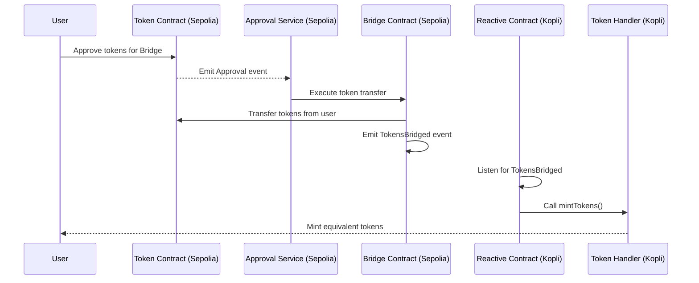

# BridgeReactive

A reactive smart contract-based bridging service that enables secure token transfers between different blockchain networks.

## Architecture



## Overview

The AutoTokenBridge service facilitates cross-chain token transfers using reactive smart contracts. It implements a secure bridging mechanism with approval services and token pair management.

## Deployed Contract Addresses

### Sepolia Chain
- bridge-main: `0xd8fFC4A8440655346B0D75eaA3270a2A2E7B1D3e`
- sepolia-service: `0xF22ddAeC23cBB0E6fDba832727D208B59433EAb8`

### Reactive-Kopli Chain
- bridge_minter: `0xE2ACf396Af641E45cC6c9342B1Ca3e15aeeFEF55`
- reactive_bridge_minter: `0x20D8D70AF616471Ff6e651f89Ff2cA1cA3fb5010`
- sepolia_service_listener: `0x0ab16De452e4cdd82F22968DC6AbE160cdA974d2`

## Deployment Commands

To deploy the contracts, use the following Forge commands:


### Deploy Token Bridge Reactive
```bash
forge create src/contracts/reactive-smart-contracts/sepolia-to-kopli-bridge.sol:TokenBridgeReactive --rpc-url $REACTIVE_RPC --private-key $REACTIVE_PRIVATE_KEY --legacy --broadcast
```

### Deploy Token Handler
```bash
forge create src/contracts/main-contracts/destination-contracts/reactive-kopli-chain/tokenHandler.sol:TokenHandler --rpc-url $REACTIVE_RPC --private-key $REACTIVE_PRIVATE_KEY --value 0.01ether --legacy --broadcast
```

### Deploy Bridge
```bash
forge create src/contracts/main-contracts/origin-contracts/reactive-kopli chain/bridge.sol:Bridge --rpc-url $SEPOLIA_RPC --private-key $SEPOLIA_PRIVATE_KEY --constructor-args 0x204a2CD5A5c45289B0CD520Bc409888885a32B8d --value 0.1ether --legacy --broadcast
```

## Key Features

1. **Token Pair Management**
   - Contract owner can add/remove token pairs
   - Supports multiple token pairs across chains

2. **Reactive Architecture**
   - Automated approval service integration
   - Real-time token transfer monitoring

3. **Security Features**
   - Locked tokens mapping for transfer verification
   - Multi-step approval process
   - Owner-controlled token pair management

## Usage Flow

1. **Owner Operations**
   - Subscribe/unsubscribe to bridge services
   - Set up token pairs for bridging
   - Manage token pair removals

2. **User Operations**
   - Approve tokens for transfer
   - Initiate withdrawal requests
   - Receive bridged tokens

3. **Bridge Operations**
   - Process token transfers
   - Maintain locked token records
   - Handle settlement requests

## Requirements

- Ethereum-compatible wallet
- Sufficient ETH for gas fees
- Tokens approved for bridging

## Security Considerations

- Always verify contract addresses before interactions
- Ensure sufficient gas for cross-chain operations
- Wait for confirmation before considering transfers complete
