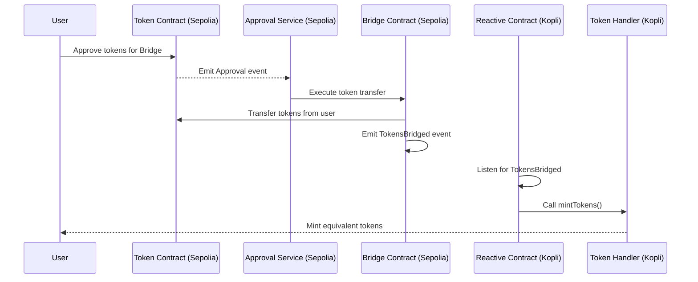

# AutoTokenBridge Service

A reactive smart contract-based bridging service that enables secure token transfers between different blockchain networks.

## Architecture



## Overview

The AutoTokenBridge service facilitates cross-chain token transfers using reactive smart contracts. It implements a secure bridging mechanism with approval services and token pair management.

## Deployed Contract Addresses

### Sepolia Chain
- Bridge Contract: `0xBE90D22f0ddC740e60101DDf02a8a396d09733D2`
- Approval Service: `0x204a2CD5A5c45289B0CD520Bc409888885a32B8d`
- sepoToken Contract: `0xc4dA73EB266E97359953Ba4658F968139DB0C4BD`

### Reactive-Kopli Chain
- Token Handler: `0x45008737C677b5251F65835ad9a3FB14750a2856`
- Token Bridge Reactive: `0x1a399361A6C528e5AA2e07b3B875B36d47D365c2`
- Approval Listener: `0x2afaFD298b23b62760711756088F75B7409f5967`
- kopliToken Contract: `0x6470135d3Ab88D91Bb0E6068805a25f426Df4007`

## Deployment Commands

To deploy the contracts, use the following Forge commands:


### Deploy Token Bridge Reactive
```bash
forge create src/contracts/reactive-smart-contracts/sepolia-to-kopli-bridge.sol:TokenBridgeReactive \
    --rpc-url $REACTIVE_RPC \
    --private-key $REACTIVE_PRIVATE_KEY \
    --legacy \
    --broadcast
```

### Deploy Token Handler
```bash
forge create src/contracts/main-contracts/destination-contracts/reactive-kopli-chain/tokenHandler.sol:TokenHandler \
    --rpc-url $REACTIVE_RPC \
    --private-key $REACTIVE_PRIVATE_KEY \
    --legacy \
    --broadcast \
    --value 0.01ether
```

### Deploy Bridge
```bash
forge create src/contracts/main-contracts/destination-contracts/reactive-kopli-chain/bridge.sol:Bridge \
    --rpc-url $REACTIVE_RPC \
    --private-key $REACTIVE_PRIVATE_KEY \
    --legacy \
    --broadcast \
    --value 0.01ether
```

## Key Features

1. **Token Pair Management**
   - Contract owner can add/remove token pairs
   - Supports multiple token pairs across chains

2. **Reactive Architecture**
   - Automated approval service integration
   - Real-time token transfer monitoring

3. **Security Features**
   - Locked tokens mapping for transfer verification
   - Multi-step approval process
   - Owner-controlled token pair management

## Usage Flow

1. **Owner Operations**
   - Subscribe/unsubscribe to bridge services
   - Set up token pairs for bridging
   - Manage token pair removals

2. **User Operations**
   - Approve tokens for transfer
   - Initiate withdrawal requests
   - Receive bridged tokens

3. **Bridge Operations**
   - Process token transfers
   - Maintain locked token records
   - Handle settlement requests

## Requirements

- Ethereum-compatible wallet
- Sufficient ETH for gas fees
- Tokens approved for bridging

## Security Considerations

- Always verify contract addresses before interactions
- Ensure sufficient gas for cross-chain operations
- Wait for confirmation before considering transfers complete
