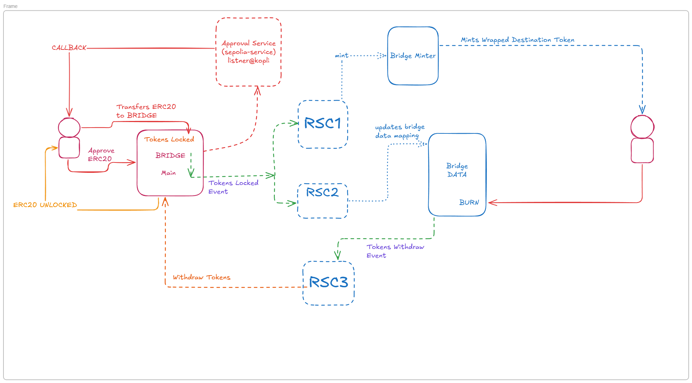

# BridgeReactive

A reactive smart contract-based bridging service that enables secure token transfers between different blockchain networks.

## Architecture




## Overview

The AutoTokenBridge service facilitates cross-chain token transfers using reactive smart contracts. It implements a secure bridging mechanism with approval services and token pair management.

## Deployed Contract Addresses

### Sepolia Chain
- approval_service: `0x5b6F2559fdE64344C2d74198e4006C35ee3f38B9`
- bridge_main: `0xbccb3370c70fFb6d86a8507AAc66fF00b8c940A3`

### Reactive-Kopli Chain
- approval_listener: `0x24d7958430C77Ae7DDbd0961556386022DC33473`
- bridge_minter: `0xD5ac0437E7B9612F1eFc016B7F2F44Eb9fD7241e`
- reactive_bridge_minter: `0xc3AbD988801f8b31c7EC92c5B6F34c3A00A6e865`
- bridge_data: `0xd4eCF818D17C7218Da6b171e1F68886C857e23Ef`
- reactive_record_update: `0x2C16c76A0464654B3fee042ac7ac44c6c82b1c2e`
- reactive_bridge_withdrawl: `0xbE4Ebf311ACD275f5D11C9833e16810961C975d8`

## Deployment Commands

To deploy the contracts, use the following Forge commands:


### Deploy Token Bridge Reactive
```bash
forge create src/contracts/reactive-smart-contracts/sepolia-to-kopli-bridge.sol:TokenBridgeReactive --rpc-url $REACTIVE_RPC --private-key $REACTIVE_PRIVATE_KEY --legacy --broadcast
```

### Deploy Token Handler
```bash
forge create src/contracts/main-contracts/destination-contracts/reactive-kopli-chain/tokenHandler.sol:TokenHandler --rpc-url $REACTIVE_RPC --private-key $REACTIVE_PRIVATE_KEY --value 0.01ether --legacy --broadcast
```

### Deploy Bridge
```bash
forge create src/contracts/main-contracts/origin-contracts/reactive-kopli chain/bridge.sol:Bridge --rpc-url $SEPOLIA_RPC --private-key $SEPOLIA_PRIVATE_KEY --constructor-args 0x204a2CD5A5c45289B0CD520Bc409888885a32B8d --value 0.1ether --legacy --broadcast
```

## Key Features

1. **Token Pair Management**
   - Contract owner can add/remove token pairs
   - Supports multiple token pairs across chains

2. **Reactive Architecture**
   - Automated approval service integration
   - Real-time token transfer monitoring

3. **Security Features**
   - Locked tokens mapping for transfer verification
   - Multi-step approval process
   - Owner-controlled token pair management

## Usage Flow

1. **Owner Operations**
   - Subscribe/unsubscribe to bridge services
   - Set up token pairs for bridging
   - Manage token pair removals

2. **User Operations**
   - Approve tokens for transfer
   - Initiate withdrawal requests
   - Receive bridged tokens

3. **Bridge Operations**
   - Process token transfers
   - Maintain locked token records
   - Handle settlement requests

## Requirements

- Ethereum-compatible wallet
- Sufficient ETH for gas fees
- Tokens approved for bridging

## Security Considerations

- Always verify contract addresses before interactions
- Ensure sufficient gas for cross-chain operations
- Wait for confirmation before considering transfers complete
